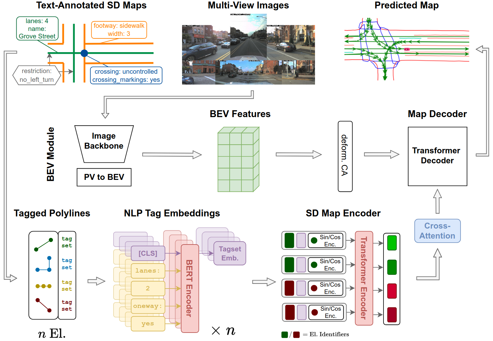

# SDTagNet: Leveraging Text-Annotated Navigation Maps for Online HD Map Construction

*Accepted for publication at NeurIPS 2025*

[Fabian Immel](https://scholar.google.com/citations?hl=de&user=uHlmd9QAAAAJ&view_op=list_works&sortby=pubdate)1 :email: , [Jan-Hendrik Pauls](https://scholar.google.com/citations?user=0LbD7HUAAAAJ&hl=de&oi=ao)2, [Richard Fehler](https://scholar.google.com/citations?hl=de&user=gOQYH4AAAAAJ&view_op=list_works&sortby=pubdate)1 , [Frank Bieder](https://scholar.google.com/citations?user=mAMWuMUAAAAJ&hl=de&oi=ao)1 , [Jonas Merkert](https://scholar.google.de/citations?user=lv_OG7MAAAAJ&hl=de&oi=ao)2 , [Christoph Stiller](https://scholar.google.com/citations?user=OeAQ2c0AAAAJ&hl=de&oi=ao)2
 
1 FZI Research Center for Information Technology 2 Institute for Measurement and Control Systems, Karlsruhe Institute of Technology

(:email:) corresponding author

### [Project Page :globe_with_meridians:](https://immel-f.github.io/SDTagNet/)

### [ArXiv Preprint](https://arxiv.org/abs/2506.08997)

Official implementation of `SDTagNet: Leveraging Text-Annotated Navigation Maps for Online HD Map Construction`

### Introduction

Autonomous vehicles rely on detailed and accurate environmental information to operate safely. High definition (HD) maps offer a promising solution, but their high maintenance cost poses a significant barrier to scalable deployment. This challenge is addressed by online HD map construction methods, which generate local HD maps from live sensor data. However, these methods are inherently limited by the short perception range of onboard sensors. To overcome this limitation and improve general performance, recent approaches have explored the use of standard definition (SD) maps as prior, which are significantly easier to maintain. We propose SDTagNet, the first online HD map construction method that fully utilizes the information of widely available SD maps, like OpenStreetMap, to enhance far range detection accuracy. Our approach introduces two key innovations. First, in contrast to previous work, we incorporate not only polyline SD map data with manually selected classes, but additional semantic information in the form of textual annotations. In this way, we enrich SD vector map tokens with NLP-derived features, eliminating the dependency on predefined specifications or exhaustive class taxonomies. Second, we introduce a point-level SD map encoder together with orthogonal element identifiers to uniformly integrate all types of map elements. Experiments on Argoverse 2 and nuScenes show that this boosts map perception performance by up to +5.9 mAP (+45%) w.r.t. map construction without priors and up to +3.2 mAP (+20%) w.r.t. previous approaches that already use SD map priors.

*Code coming soon!*